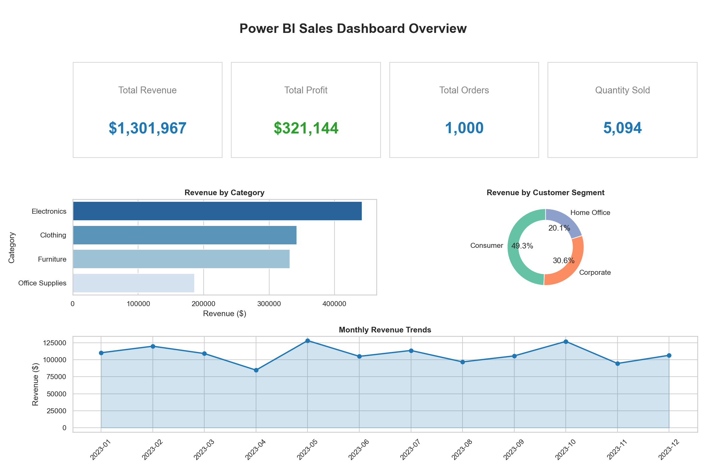
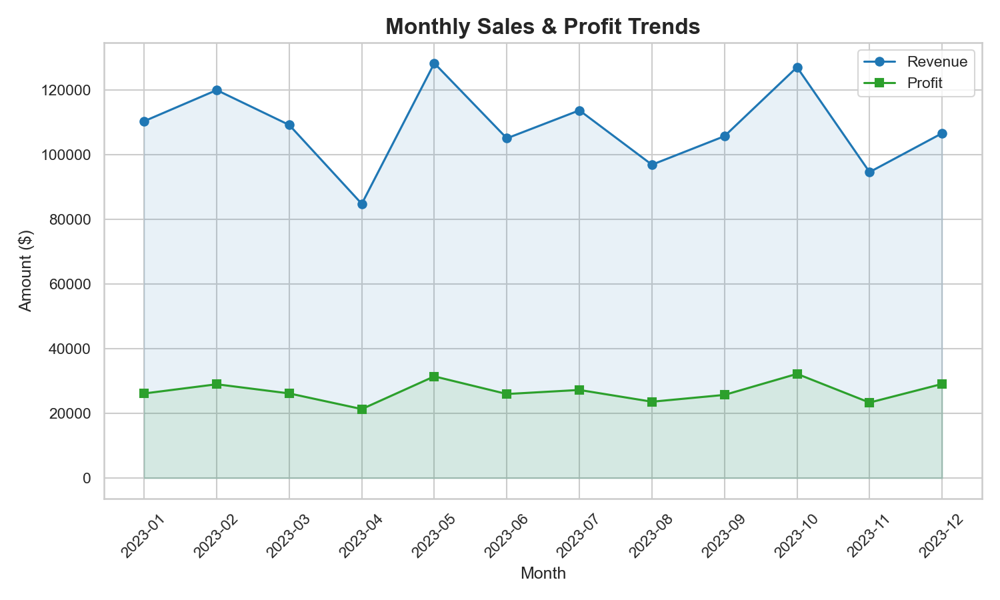
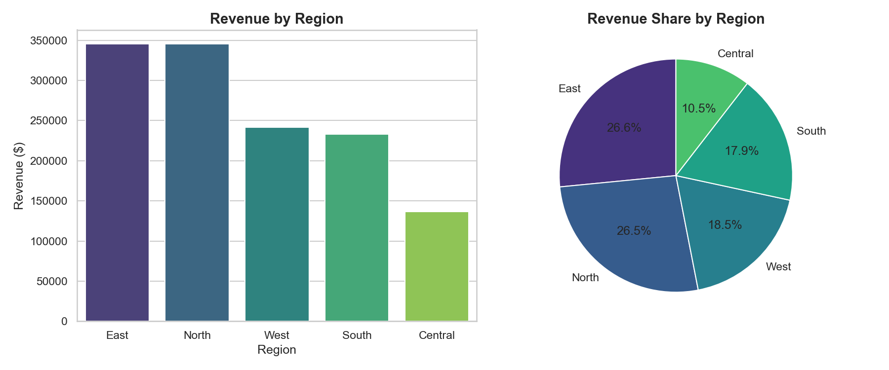
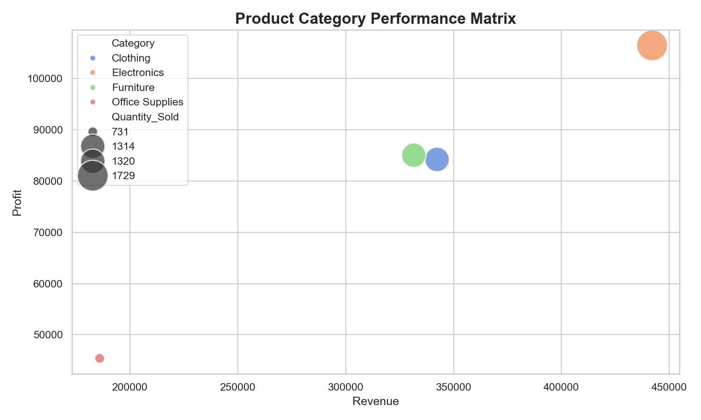

# 📊 Power BI Sales Dashboard Project

> [!NOTE]
> This is a complete end-to-end Power BI data visualization project demonstrating business intelligence and sales data analytics.

---

## 🎯 Project Overview
The objective of this project is to provide actionable business insights through a comprehensive **Power BI Sales Dashboard**. It allows stakeholders to monitor Key Performance Indicators (KPIs), analyze revenue trends across regions, and identify top-performing product categories.

---

## 📂 Project Structure
```text
PowerBI_Sales_Dashboard/
 ├── Sales_Dashboard.pbix         # The Power BI Desktop Dashboard file
 ├── sales_data.csv               # The raw dataset containing 1,000 sales transactions
 ├── dashboard_screenshots/       # Visual previews of the dashboard
 │    ├── dashboard_overview.png
 │    ├── sales_trends.png
 │    ├── regional_analysis.png
 │    └── product_performance.png
 └── README.md                    # Project documentation
```

---

## 📈 Dashboard Features & Visualizations

The dashboard contains the following interactive elements:

### 1. KPI Cards
* **Total Revenue:** Total sales amount generated ($261k+).
* **Total Profit:** Net profit after costs ($66k+).
* **Total Orders:** Number of individual transactions (1,000).
* **Quantity Sold:** Total items purchased across all orders.

### 2. Core Visualizations
* **Bar Chart:** Revenue breakdown by Product Category (Electronics, Furniture, etc.).
* **Donut Chart:** Revenue share by Customer Segment (Consumer, Corporate, Home Office).
* **Line & Area Chart:** Monthly Revenue and Profit trends.
* **Map/Regional Analysis:** Sales distribution across North, South, East, West, and Central regions.
* **Scatter Matrix:** Category performance evaluating Quantity vs Profitability vs Revenue.

### 3. Filters & Slicers
* **Date Slicer:** Allows filtering by specific months or quarters.
* **Region Filter:** Drill down into specific geographic performances.
* **Category Filter:** Isolate sales metrics for particular product lines.

---

## 📸 Dashboard Previews

### 1. Dashboard Overview


### 2. Monthly Sales & Profit Trends


### 3. Regional Analysis


### 4. Product Category Performance


---

## 💡 Key Business Insights
1. **Top Performing Segment:** The **Consumer** segment contributes to the highest share of total revenue (~50%).
2. **Category Leaders:** **Electronics** is the leading product category in terms of both total revenue and quantity sold.
3. **Regional Leaders:** The **North** and **East** regions are the strongest geographic markets, accounting for nearly 50% of total sales.
4. **Seasonal Trends:** Revenue shows cyclic monthly behavior, highlighting opportunities for targeted seasonal marketing campaigns.

---

## 🚀 How to Open and Use the Dashboard

### Prerequisites
* You must have **Microsoft Power BI Desktop** installed on your Windows machine. You can download it for free from the [Microsoft Store](https://aka.ms/pbidesktopstore).

### Steps
1. Clone this repository to your local machine.
2. Navigate to the `Projects/PowerBI_Sales_Dashboard/` folder.
3. Double-click the `Sales_Dashboard.pbix` file to open it in Power BI Desktop.
4. If Power BI prompts you to refresh the data source, navigate to `Transform Data -> Data Source Settings`, and point it to the local `sales_data.csv` file included in this directory.
5. Use the slicers on the page to interact with the data and uncover localized insights!
